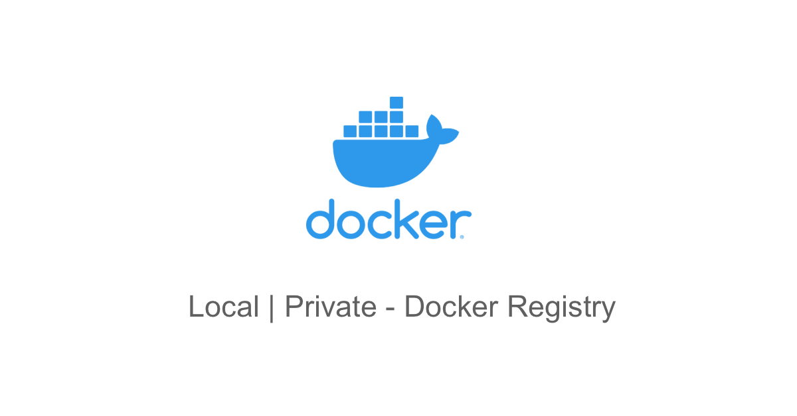

# Local | Private - Docker Registry



### Start docker
Using [makefile](https://opensource.com/article/18/8/what-how-makefile)
```bash
make init
```
login: register 
password: password
>http://localhost:500

### Change password 
Using [htpasswd](https://docs.openshift.com/container-platform/4.8/authentication/identity_providers/configuring-htpasswd-identity-provider.html)
```bash
htpasswd -c -B -b </path/to/htpasswd> <user_name> <password>
```

Show catalogs
>http://localhost:5000/v2/_catalog

### Push docker images
```bash
REGISTRY=localhost:5000 make push
```
### Authorize to docker registry
```bash
docker login -u registry -p password localhost:5000
```

### Install docker in server 
>with ansible in provisioning folder
>cd provisioning
> setup ssh host hosts.yml.dist > hosts.yml
Install docker | certbot in server
```bash
make server
```

### Setup ssh key
```bash 
make authorize
```

### Deploy
>change 152.67.70.96 > your server address
```bash
HOST=152.67.70.96 PORT=22 make deploy HTPASSWD_FILE=htpasswd
```

### Remove docker images
```shell
ssh deploy@152.67.70.96 -t "docker system prune -af"
```

### Docker-registry Bcode URL 
>https://registry.bcode.kg/v2


